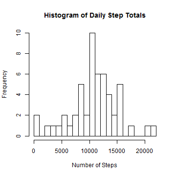
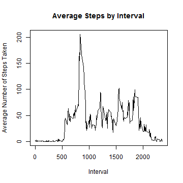
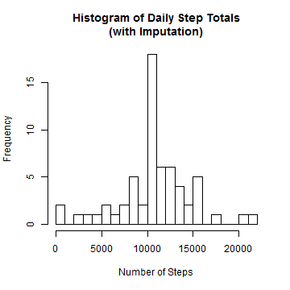
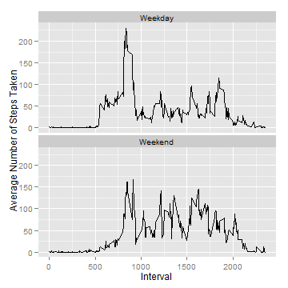

*Peer Assessment 1 -- Reproducible Research*
========================================================

### Loading and preprocessing the data

* Load the data.

```r
data = read.csv("activity.csv")
head(data)
```

```
##   steps       date interval
## 1    NA 2012-10-01        0
## 2    NA 2012-10-01        5
## 3    NA 2012-10-01       10
## 4    NA 2012-10-01       15
## 5    NA 2012-10-01       20
## 6    NA 2012-10-01       25
```

* Process/transform the data (if necessary) into a format suitable for your analysis

```r
# Remove records with 'steps' = 'NA'
data2 = na.omit(data)
```

### What is mean total number of steps taken per day?

* Make a histogram of the total number of steps taken each day

```r
data2.noDate = subset(data2, select = -date)
data2.date = subset(data2, select = date)

# Sum steps within dates
dailySteps = aggregate(data2.noDate, data2.date, sum)

hist(dailySteps[,2], breaks=30, main='Histogram of Daily Step Totals', xlab='Interval')  
```

 

* Calculate and report the mean and median total number of steps taken per day

```r
meanDailySteps = mean(dailySteps[,2])
medianDailySteps = median(dailySteps[,2])
```
The  **mean**  number of steps taken per day is:       **10,766.19**.  
The **median** number of steps taken per day is: **10,765**.

### What is the average daily activity pattern?

* Make a time series plot of the 5-minute interval and the average number of steps taken, averaged across all days 

```r
# Calculate the average number of steps taken (across all days) per 5-minute interval.
data2.steps = subset(data2, select = steps)
data2.interval = subset(data2, select = interval)

aveIntervalSteps = aggregate(data2.steps, data2.interval, mean)

plot(unique(data2$interval), aveIntervalSteps$steps, type='l', main='Average Steps by Interval', xlab='Interval', ylab='Average Number of Steps Taken')
```

 

* Which 5-minute interval, on average across all the days in the dataset, contains the maximum number of steps?

```r
maxSteps = max(aveIntervalSteps$steps)
highInterval = unique(data2$interval)[which(aveIntervalSteps[,2] == maxSteps)]
```
The greatest average number of steps taken (**206.17**) were taken in interval **835**. 

### Imputing missing values

* Calculate and report the total number of missing values in the dataset (i.e. the total number of rows with NAs)

```r
data3 = data
nas = sum(is.na(data3$steps))
```
**2304** rows in the dataset had missing values.  

* Devise a strategy for filling in all of the missing values in the dataset. 

```r
# Identify the intervals that have missing values.
naIntervals = data3[which(is.na(data3$steps)),3]

# Find the values (averge number of steps taken per given interval) to substitute for the missing values.
replacements = aveIntervalSteps[match(naIntervals, aveIntervalSteps[,1]), 2]
```
Via the preceding code, each missing 'steps' value was repaced with the average number of steps taken during the interval (identified by number) associated with that missing value. (For the calculations of the average steps taken per interval, see the R code immediately preceding the line graph above.)   

* Create a new dataset that is equal to the original dataset but with the missing data filled in.

```r
# Replace the missing data with 'replacements' as calculated above.
data3[which(is.na(data3$steps)),1] = replacements
```

* Make a histogram of the total number of steps taken each day and calculate and report the mean and median total number of steps taken per day. 

```r
# Calculate the total number of steps taken per day for imputed data.
data3.noDate = subset(data3, select = -date)
data3.date = subset(data3, select = date)

dailyStepsImputed = aggregate(data3.noDate, data3.date, sum)

hist(dailyStepsImputed[,2], breaks=30, main='Histogram of Daily Step Totals\n(with Imputation)', xlab='Interval')
```

 

```r
# Calculate the mean and median number of steps taken.
meanDailyStepsImputed = mean(dailyStepsImputed[,2])
medianDailyStepsImputed = median(dailyStepsImputed[,2])
```
The  **mean**  number of steps taken per day is:       **10,766.19**.  
The **median** number of steps taken per day is: **10,766.19**.

* Do these values differ from the estimates from the first part of the assignment? What is the impact of imputing missing data on the estimates of the total daily number of steps?   
  
The mean number of steps taken per day did not change after imputation, but the median number of steps taken did change. Because the mean was higher than the median before imputation, all formerly missing values were higher than the original median after replacement. Thus, the median was shifted upward.
Using the described imputation method had no impact on the estimation of total number of steps taken except for causing the distribution of daily step totals to become more peaked (because of the increased frequency of the mean value).

### Are there differences in activity patterns between weekdays and weekends?

* Create a new factor variable in the dataset with two levels - "weekday" and "weekend" indicating whether a given date is a weekday or weekend day.

```r
# Identify the weekday by the given date.
data3$days = weekdays(as.Date(as.character(data3$date)))

# Convert weekdays to 'Weekend' or 'Weekday.' 
data3$weekday_or_weekend = ifelse(data3$days %in% c('Saturday', 'Sunday'), 'Weekend', 'Weekday')
```


* Make a panel plot containing a time series plot (i.e. type = "l") of the 5-minute interval and the average number of steps taken, averaged across all weekday days or weekend days.

```r
# Create lists for the aggregate() function.
data3.steps = subset(data3, select = steps)
data3.interval = subset(data3, select = interval)
data3.weekday_or_weekend = subset(data3, select = weekday_or_weekend)

# Calculate the average number of steps taken, grouping by interval X weekday vs. weekend. 
aveIntervalStepsImputed = aggregate(data3.steps, c(data3.interval,data3.weekday_or_weekend), mean)

library(ggplot2)

plot = ggplot(aveIntervalStepsImputed, aes(interval, steps)) + geom_line()

plot + facet_wrap(~weekday_or_weekend, nrow=2) + xlab('Interval') + ylab('Average Number of Steps Taken')
```

 
***
---
***
---
***
---
***
---
***


